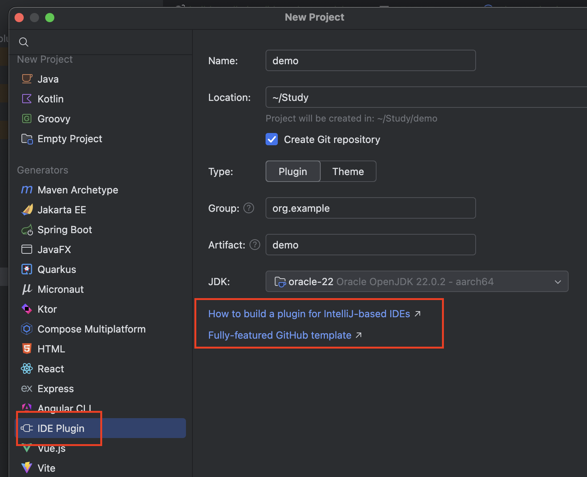
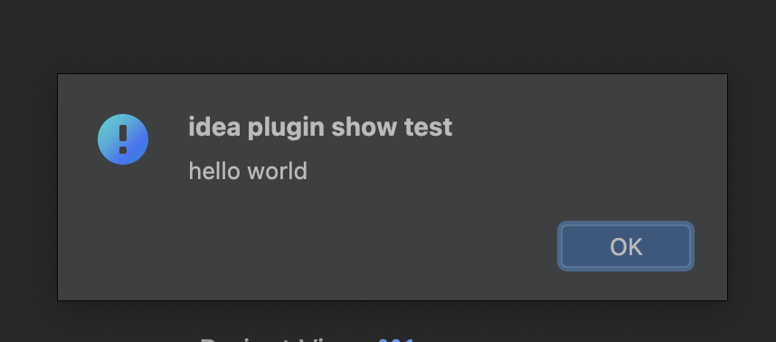

2024 idea开发插件

#idea插件开发
1.需要安装Plugin DevKit插件
2.2024最新版本使用的是IntelliJ Platform Gradle Plugin (2.x)版本，配置和1.x 差别很大
最简单的方法，就是在新建项目时，github上有两个template，都是最新版本，可以参考
3.其他的配置修改，其实也很简单
两个文件要修改
build.gradle.kts
```
plugins {
    id("java")
    id("org.jetbrains.kotlin.jvm") version "1.9.25"
    // 新增 intellij-platform 2.2.0
    id("org.jetbrains.intellij.platform") version "2.2.0"
}

group = "org.example"
version = "1.0-SNAPSHOT"

repositories {
    mavenCentral()
    // 平台依赖
    intellijPlatform {
        defaultRepositories()
    }
}

dependencies {
    // 平台依赖
    intellijPlatform {
        create(providers.gradleProperty("platformType"), providers.gradleProperty("platformVersion"))
        // 这里如果你用的是破解版的idea 这里用不了local，因为项目运行时要让你激活
        // local("/Applications/IntelliJ IDEA.app")
    }
}
```

gradle.properties
```properties
//指定平台类型和版本
platformType = IC
platformVersion = 2023.3.8
```

就可以运行
剩下的就是开发业务需求，没其他特别的，找几个项目看下就OK啦# idea-plug-study
